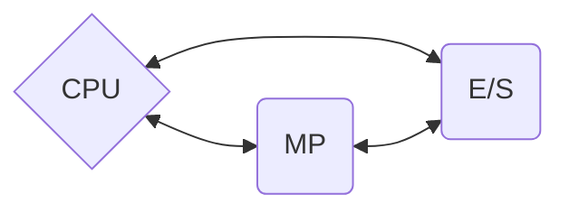
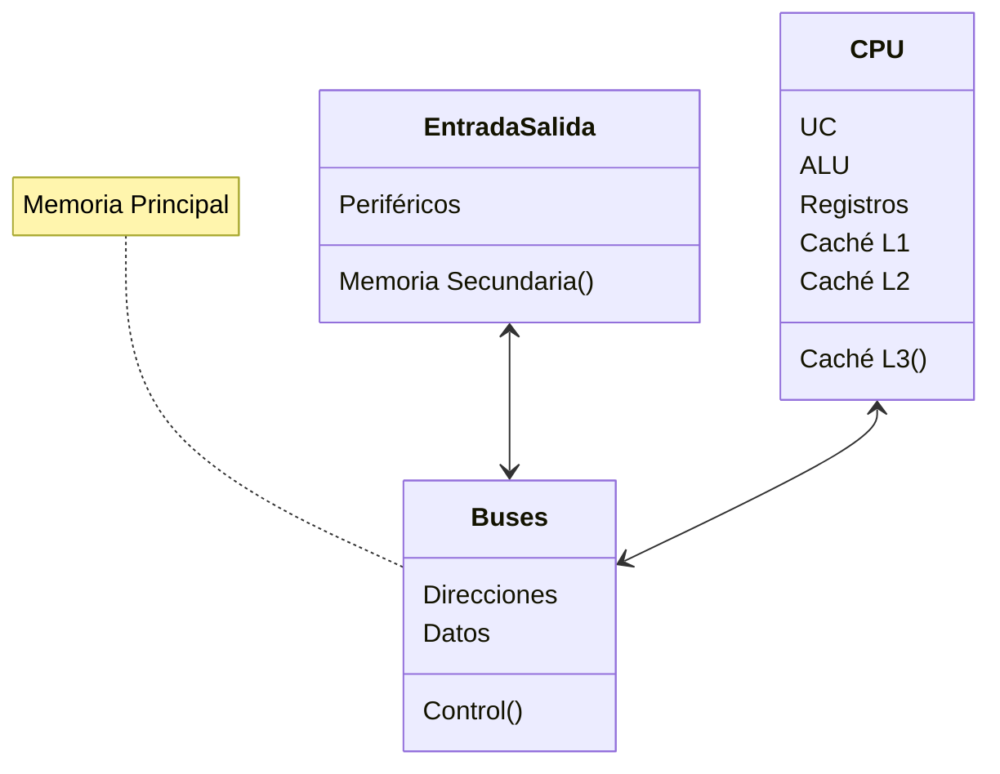
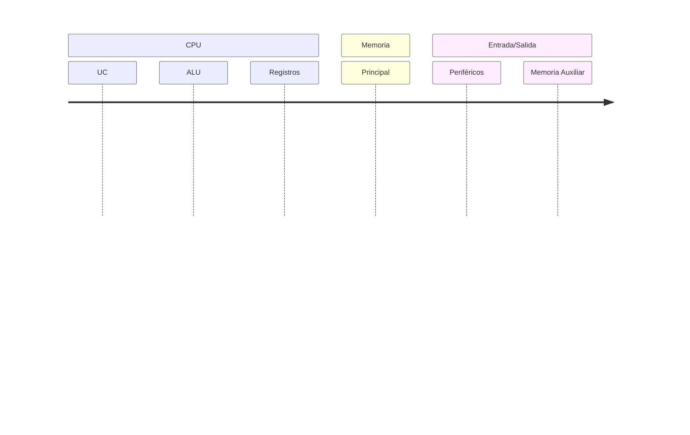

# 💾 Introducción

La informática es la ciencia que se encarga del estudio y aplicación del procesamiento de datos, utilizando medios electrónicos para el almacenamiento, transmisión y procesamiento de la información.

## 1.1 🖥️ El sistema informático y tipos 

Un sistema informático es un conjunto de recursos técnicos y humanos que interactúan y se organizan con el fin de administrar, procesar y transmitir información de manera eficiente. Los sistemas informáticos se clasifican en varios tipos:

- **Superordenadores**: 🚀 Son máquinas poderosas diseñadas para realizar cálculos complejos a alta velocidad.
- **Macroordenadores**: 🏢 Sistemas grandes utilizados en centros de datos para tareas de gran envergadura.
- **Servidores**: 🖧 Computadoras especializadas que brindan recursos y servicios a otras máquinas.
- **Estaciones de trabajo**: 💼 Máquinas potentes para tareas específicas como diseño gráfico o análisis de datos.
- **Ordenadores personales o PC**: 🖱️ Equipos diseñados para ser usados por un individuo, comunes en hogares y oficinas.

## 1.2 📜 Evolución histórica de la informática 

La palabra informática deriva de **infor**mación auto**mática**.
La historia de la informática ha evolucionado desde herramientas simples como el ábaco 🧮, pasando por las calculadoras mecánicas, hasta llegar a los modernos computadores electrónicos. El verdadero inicio de la computación, tal como la conocemos, se da con la aparición del concepto de programa interno: se introduce un programa, se le suministran datos de entrada, el programa procesa estos datos y se obtienen resultados como datos de salida.

### 1.2.1 🔄 Generaciones de ordenadores 

A lo largo de la historia, hemos presenciado diversas generaciones de ordenadores, cada una con características distintivas:

- **1ª generación (1940 a 1959)**:  Funcionaban con lámparas de vacío 💡, lo cual los hacía muy grandes e ineficientes energéticamente. Se consideraban un arma de guerra 💣.
- **2ª generación (1960 a 1965)**: Las lámparas de vacío son sustituídas por transistores 📻. Aparecen los periféricos 🖨️ y lenguajes de programación 👨‍💻.
- **3ª generación (1966 a 1971)**: Los transistores se miniaturizan y se encapsulan en chips 📦️.
- **4ª generación (1971 a 1981)**: Aparece el microprocesador (más transistores en menos espacio) y Unix 🐧.
- **5ª generación (1981 hasta la actualidad)**: Surge el ordenador personal o PC 💻, los microprocesadores tienen varios núcleos 🔢 y aparece internet. La 5ª generación comienza cuando el ordenador no es exclusivo del ámbito militar 👨🏻‍✈️, ni científico 👨🏻‍🔬 o gubernamental 🏛️, sino que entra en el ámbito doméstico 🏘️.
 
> Nota: Aunque tradicionalmente se habla de cinco generaciones, la evolución reciente con la expansión de internet, la nube, y el avance del hardware sugiere que estamos entrando o ya hemos entrado en una 6ª generación.

## 1.3 🔧 Componentes del hardware 

El hardware se refiere a los componentes físicos que conforman un sistema informático. Estos dispositivos son esenciales para que el software funcione y para que los usuarios interactúen con las computadoras.

### 1.3.1 🛠️ Elementos físicos 

- **Carcasa**: 📦 Protege y alberga los componentes internos del ordenador.
- **Periféricos**: 🔌 Dispositivos que interactúan con el sistema central.
    * **Entrada**: ⌨️ Como teclados o ratones.
    * **Salida**: 🖥️ Como monitores o impresoras.
    * **Mixtos**: 🖲️ Dispositivos que pueden funcionar tanto de entrada como de salida, como una pantalla táctil.
- **Memorias auxiliares**: 💾 Dispositivos de almacenamiento externo como CD's. 💿, tarjetas SD o unidades USB.

### 1.3.2 🔧 Elementos funcionales

**Unidad Central de Proceso (UCP , en inglés CPU):** 
Realiza las operaciones de cálculo y toma decisiones según las instrucciones de un programa.

- **Unidad Aritmético Lógica (UAL, en inglés ALU):** 
Ejecuta operaciones matemáticas y lógicas.

- **Unidad de Control (UC, CU en inglés):** 
Dirige y coordina las actividades de los componentes del sistema.

**Memoria Principal:** 
Almacena datos e instrucciones para que la CPU pueda acceder rápidamente.

**Buses:** 
Conjunto de líneas de comunicación que transportan datos entre componentes.

- **Datos:** 
Líneas que transportan información o valores de un lugar a otro.

- **Direcciones:** 
Líneas que especifican la fuente o destino de los datos.

- **Control:** 
Líneas que controlan el flujo y la operación de datos y direcciones.

**Unidad de Entrada Salida (E/S):** 
Permite a la computadora interactuar con el entorno, recibiendo y enviando datos. También forma parte de esta unidad la memoria secundaria.

La máquina de Von Neumann, o arquitectura de Von Neumann, es un modelo conceptual que sirve de base para el diseño de la mayoría de las computadoras modernas. Hay diferentes formas de representarla, como te muestro a continuación:

